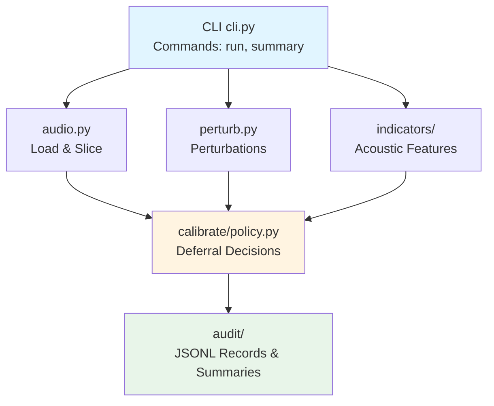

# Audio Trust Harness

> **📦 Monorepo Notice**: This is the **Evaluation Framework** component of the `sonotheia-examples` monorepo.  
> See the [root README](../README.md) for an overview of all components, or jump to [Integration Examples](../examples/README.md) for production integration patterns.
>
> **For AI Agents**: This evaluation framework inherits governance files from the repository root: [AGENT_KNOWLEDGE_BASE.md](../AGENT_KNOWLEDGE_BASE.md), [CONTRIBUTING.md](../CONTRIBUTING.md), and [GEMINI.md](../GEMINI.md). Read these before making changes.
>
> [!IMPORTANT]
> **Research Tool Disclaimer**
>
> This is a **research and evaluation framework** for testing acoustic indicator robustness, NOT a production detection system. The framework demonstrates **methodology for evaluating ANY indicator**, not specific authenticity detection algorithms.
>
> - **Purpose**: Stress-test and evaluate custom indicators under adversarial perturbations
> - **Not for**: Binary "real/fake" classification or production deepfake detection
> - **Extensible**: Designed for users to integrate their own proprietary indicators and perturbations
> - **Configuration**: All parameters are examples—customize for your specific research needs
>
> See [Configuration Guide](config/README.md) for customizing parameters and [What This Is Not](#what-this-is-not) for limitations.
>
> ⚠️ **Active Development**: This evaluation framework is in **active development**. Features are being added, methodologies refined, and the framework is continuously evolving.

[](https://www.python.org/downloads/)
[](LICENSE)

## Audio Stress-Test Harness for Indicator Robustness Evaluation

A transparent, reproducible framework for evaluating how acoustic indicators behave under adversarial perturbations, producing deferral signals for human-in-the-loop audio authenticity workflows.

---
> [!NOTE]
> **New to Audio Trust Harness?**
> Start with the [**Showcase Quickstart**](documentation/SHOWCASE_QUICKSTART.md).
> Then explore [**Interpreting Results**](documentation/INTERPRETING_RESULTS.md) and [**Common Workflows**](documentation/WORKFLOWS.md).

---

## Table of Contents

- [What This Is](#what-this-is)
- [What This Is Not](#what-this-is-not)
- [Quick Start](#quick-start)
- [Core Concepts](#core-concepts)
- [How It Works](#how-it-works)
- [Usage Guide](#usage-guide)
- [Understanding Output](#understanding-output)
- [Architecture](#architecture)
- [Troubleshooting](#troubleshooting)
- [FAQ](#faq)
- [Limitations & Caveats](#limitations--caveats)
- [Testing](#testing)
- [Development](#development)
- [License](#license)
- [Citation & References](#citation--references)

---

## What This Is

Audio Trust Harness is a **research and evaluation tool** designed to answer a critical question: *How robust are acoustic indicators when subjected to controlled adversarial perturbations?*

This framework provides a **methodology for testing ANY indicator**—whether standard spectral features or proprietary algorithms—against various stress conditions.

- **Stress-tests indicators** by applying controlled transformations (noise, codec compression, pitch shifts)
- **Measures stability** of acoustic features across these perturbations
- **Produces deferral signals** that preserve uncertainty and guide human review
- **Generates audit trails** with complete provenance and reproducibility
- **Extensible architecture** for custom indicators and perturbations (see [Configuration Guide](config/README.md))

### Key Use Cases

1. **Research & Evaluation**: Test new acoustic indicators or deferral policies against adversarial perturbations
2. **Validation**: Verify that indicators remain stable under expected transformations (network compression, transcoding)
3. **Quality Assurance**: Identify audio samples that require manual review in content moderation pipelines
4. **Indicator Development**: Prototype and benchmark new features for robustness before production deployment

### Why This Matters

Acoustic indicators (spectral features, energy patterns, etc.) form the foundation of many audio analysis systems. But how do they behave when audio is perturbed—intentionally or through natural processing? This harness provides:

- **Quantitative fragility metrics** showing how much indicators vary under stress
- **Reproducible results** via deterministic perturbations with seeds
- **Transparent decisions** with rules-based logic (no black-box ML)
- **Human-centered outputs** that defer to human judgment rather than making false-confidence claims
- **Customizable framework** where users supply their own indicators and tune parameters

### Framework Philosophy

The harness separates **evaluation methodology** (how to test) from **indicator implementations** (what to test):

- **Generic perturbations**: Example parameters for exploring robustness (customize via [config files](config/))
- **Sample indicators**: Basic spectral features as reference implementations
- **Plugin-ready**: Designed for users to add proprietary indicators without modifying core code
- **Configuration-driven**: All thresholds and parameters externalized for domain-specific tuning

> [!NOTE]
> **Included parameters are examples for research exploration, not production-tuned values.**
> Users are expected to integrate their own indicators and tune parameters for their specific use case.

## What This Is Not

This is **NOT**:

- A production SDK or API client
- A binary "real/fake" detector with accuracy claims
- A deepfake detection system
- A tool for creating or distributing synthetic audio
- A proprietary detection algorithm (it's a testing framework)

**This harness is for research and evaluation** of indicator robustness. It provides a methodology for testing indicators—the actual indicators you test are yours to implement and configure.

Included indicators (spectral centroid, flatness, etc.) are **generic examples** demonstrating the framework. Production systems should integrate domain-specific, proprietary indicators through the configuration system.

The harness produces deferral recommendations ("accept", "defer_to_review", "insufficient_evidence") based on stability analysis, not classification scores.

## Quick Start

### Prerequisites

- Python 3.11 or higher
- pip

### Installation

```bash
# Clone the repository
git clone https://github.com/doronpers/audio-trust-harness.git
cd audio-trust-harness

# Create a virtual environment
python -m venv venv
source venv/bin/activate  # On Windows: venv\Scripts\activate

# Install dependencies
pip install -e .

# Or install with dev dependencies
pip install -e ".[dev]"
```

### Verify Installation

```bash
# Check that the tool is accessible
python -m audio_trust_harness --help

# You should see the CLI help with available commands
```

### Run the Harness

```bash
# Basic usage - analyzes entire file with default perturbations (none, noise)
python -m audio_trust_harness run --audio sample.wav --out out/audit.jsonl

# Advanced usage with custom options
python -m audio_trust_harness run \
  --audio sample.wav \
  --out out/audit.jsonl \
  --slice-seconds 10 \
  --hop-seconds 10 \
  --seed 1337 \
  --perturbations none,noise,codec_stub \
  --max-slices 5

# With parallel processing (faster for many slices)
python -m audio_trust_harness run \
  --audio sample.wav \
  --out out/audit.jsonl \
  --parallel \
  --workers 4
```

**What happens during a run:**

1. Audio is loaded and normalized to 16kHz mono
2. File is split into 10-second slices (configurable)
3. Each perturbation is applied to each slice
4. Acoustic indicators are computed for each perturbed slice
5. Fragility scores are calculated by comparing indicator stability
6. Deferral decisions are made based on threshold rules
7. Complete audit trail is written to JSONL file

### CLI Options

- `--audio`: Path to input WAV file (required)
- `--out`: Path to output JSONL audit file (required)
- `--slice-seconds`: Duration of each slice in seconds (default: 10, must be > 0)
- `--hop-seconds`: Hop duration between slices (default: 10, non-overlapping, must be > 0)
- `--seed`: Random seed for deterministic perturbations (default: 1337)
- `--perturbations`: Comma-separated list of perturbations (default: "none,noise")
  - `none`: Identity (no perturbation)
  - `noise`: Additive Gaussian noise (configurable SNR, default: 20dB from config)
  - `codec_stub`: Lowpass filter + quantization (approximation, not real codec)
  - `pitch_shift`: Pitch shift stub using resampling (approximation, changes both pitch and duration)
  - `time_stretch`: Time stretch stub using resampling (approximation, changes both duration and pitch)
- `--max-slices`: Maximum number of slices to process (optional, must be > 0 when set; processes all if not set)
- `--parallel`: Enable parallel processing of slices (default: False)
- `--workers`: Number of worker processes for parallel processing (default: CPU count)
- `--fragility-threshold`: Fragility threshold for deferral (default: 0.3 from config, CV > threshold triggers deferral)
- `--clipping-threshold`: Clipping detection threshold (default: 0.95 from config, amplitude > threshold indicates clipping)
- `--min-duration`: Minimum slice duration for valid analysis (default: 0.5 seconds from config)

> [!TIP]
> **Customizing Parameters**: All default values are loaded from configuration files in `config/`. You can customize these files or override them via CLI flags. See [Configuration Guide](config/README.md) for details.

### Generate Summary Report

After processing audio, generate an aggregated statistical summary:

```bash
python -m audio_trust_harness summary \
  --audit out/audit.jsonl \
  --out out/summary.json
```

**Summary includes:**

- Overall deferral action distribution (accept/defer/insufficient_evidence)
- Fragility score statistics across all slices (mean, std, min, max, median)
- Indicator stability metrics for each acoustic feature
- Per-slice breakdown with individual deferral decisions

Use summaries to quickly assess overall audio quality and identify slices requiring attention.

---

## Core Concepts

### Deferral Philosophy

Unlike binary classifiers that output "real" or "fake" with confidence scores, this harness produces **deferral signals** that preserve uncertainty:

- **`accept`**: Indicators are stable across perturbations → consistent with expected robustness
- **`defer_to_review`**: High fragility detected → indicators vary significantly, requires human review
- **`insufficient_evidence`**: Invalid input detected → audio is clipped, too short, or otherwise problematic

**Why deferral over classification?**

Audio authenticity is context-dependent and nuanced. A clip may be synthetic yet contextually appropriate, or authentic yet acoustically unusual. By deferring to human judgment in uncertain cases, we:

- Avoid false confidence in automated decisions
- Enable human-in-the-loop workflows
- Preserve interpretability and transparency
- Reduce risk of consequential false positives/negatives

### Practical Example

```text
Scenario: You receive a 30-second audio clip for content verification.

The harness processes it:
- Slices: 3 slices of 10s each
- Perturbations: none, noise, codec_stub
- Result: Slice 0 → accept, Slice 1 → defer_to_review, Slice 2 → accept

Interpretation: Slice 1 shows acoustic instability (high fragility).
Action: Human reviewer listens to slice 1 (10-20s range) for manual assessment.
```

This targeted review is more efficient than reviewing entire files or relying on binary verdicts.

### Fragility Score

The **fragility score** quantifies indicator stability:

- Calculated as the coefficient of variation (CV = std/mean) across perturbations
- Low fragility (CV < 0.3): Indicator is robust → accept
- High fragility (CV > 0.3): Indicator is unstable → defer to review
- Computed independently for each acoustic indicator

**Example**: If spectral centroid is 1500Hz with ±50Hz variation across perturbations, CV = 50/1500 = 0.033 (stable). If variation is ±500Hz, CV = 0.33 (fragile).

---

## Understanding Output

### JSONL Audit Records

Each line in the output JSONL file represents one processed slice with one perturbation:

```json
{
  "run_id": "run_20260104_201530_a3f9c2",
  "timestamp": "2026-01-04T20:15:30.123456",
  "tool_version": "0.1.0",
  "git_sha": "abc1234",
  "python_version": "3.11.5",
  "input_file": "sample.wav",
  "sample_rate": 16000,
  "slice_index": 0,
  "slice_start_s": 0.0,
  "slice_duration_s": 10.0,
  "perturbation_name": "noise",
  "perturbation_params": {"snr_db": 20.0},
  "indicators": {
    "spectral_centroid_mean": 1523.45,
    "spectral_centroid_std": 234.12,
    "spectral_flatness_mean": 0.234,
    "spectral_flatness_std": 0.089,
    "rms_energy": 0.045,
    "crest_factor": 12.3
  },
  "deferral": {
    "recommended_action": "accept",
    "fragility_score": 0.12,
    "reasons": []
  },
  "warnings": []
}
```

### Interpreting Results

**Key fields to examine:**

1. **`deferral.recommended_action`**: The primary decision
   - `"accept"` → Audio indicators are stable, proceed with confidence
   - `"defer_to_review"` → High fragility detected, manual review needed
   - `"insufficient_evidence"` → Audio quality issues, cannot assess reliably

2. **`deferral.fragility_score`**: Quantitative stability measure
   - Typical range: 0.0-0.5 for most audio
   - < 0.3: Stable indicators
   - > 0.3: Fragile indicators (triggers deferral)
   - Can exceed 1.0 in extreme cases (e.g., CV when mean approaches zero)

3. **`indicators`**: Raw acoustic feature values
   - Compare across perturbations to see which features are unstable
   - Higher variance in a specific indicator suggests sensitivity to that perturbation type

4. **`deferral.reasons`**: Specific issues detected
   - Examples: `["clipping_detected"]`, `["audio_too_short"]`

5. **`warnings`**: Non-critical issues that don't trigger deferral
   - Examples: resampling notices, borderline metrics

### Typical Workflow

1. **Run analysis**: `python -m audio_trust_harness run --audio file.wav --out audit.jsonl`
2. **Generate summary**: `python -m audio_trust_harness summary --audit audit.jsonl --out summary.json`
3. **Review summary**: Check deferral distribution, identify high-fragility slices
4. **Investigate deferrals**: For `defer_to_review` slices, examine which indicators are unstable
5. **Human review**: Listen to flagged slices at their timestamp ranges
6. **Make decision**: Use automated deferral + human judgment for final determination

---

## Architecture

### Component Overview



**Component responsibilities:**

- **CLI (cli.py)**: Command-line interface (run, summary, version)
- **audio.py**: Load WAV files, resample to 16kHz mono, split into slices
- **perturb.py**: Apply deterministic perturbations (noise, codec, pitch, time)
- **indicators/**: Compute acoustic features (spectral, temporal)
- **calibrate/policy.py**: Evaluate fragility, make deferral decisions
- **audit/**: Generate JSONL records and summary reports

**Design principles:**

- **Modular**: Each component has a single responsibility
- **Testable**: Pure functions with deterministic behavior
- **Transparent**: Rules-based logic, no ML black boxes
- **Auditable**: Complete provenance in JSONL output

---

## Usage Guide

### Best Practices

1. **Start with defaults**: Use `none,noise` perturbations first to establish baseline
2. **Use consistent seeds**: Same seed = reproducible results for regression testing
3. **Monitor deferrals**: High deferral rate may indicate audio quality issues or overly sensitive thresholds
4. **Verify input format**: Convert MP3/FLAC/etc. to WAV before processing
5. **Check audit logs**: Always examine JSONL output for warnings and specific issues

### Common Workflows

#### Scenario 1: Quick validation of a single file

```bash
python -m audio_trust_harness run --audio sample.wav --out audit.jsonl
python -m audio_trust_harness summary --audit audit.jsonl --out summary.json
cat summary.json  # Check deferral distribution
```

#### Scenario 2: Comprehensive stress test

```bash
python -m audio_trust_harness run \
  --audio sample.wav \
  --out audit.jsonl \
  --perturbations none,noise,codec_stub,pitch_shift,time_stretch \
  --seed 42
```

#### Scenario 3: Processing a batch of files

```bash
for file in audio/*.wav; do
  out="results/$(basename "$file" .wav)_audit.jsonl"
  python -m audio_trust_harness run --audio "$file" --out "$out"
done
```

#### Scenario 4: Focus on specific segment

```bash
# Process only first 50 seconds (5 slices of 10s)
python -m audio_trust_harness run \
  --audio long_file.wav \
  --out audit.jsonl \
  --max-slices 5
```

#### Scenario 5: Custom thresholds for domain-specific tuning

```bash
# Use stricter fragility threshold (triggers deferral at 20% variation instead of 30%)
python -m audio_trust_harness run \
  --audio sample.wav \
  --out audit.jsonl \
  --fragility-threshold 0.2 \
  --clipping-threshold 0.90 \
  --min-duration 1.0
```

---

## How It Works

### Audio Pipeline

1. **Load**: Read WAV file, enforce 16kHz mono (resample if needed)
2. **Slice**: Split audio into fixed-duration segments
3. **Perturb**: Apply perturbations (deterministic with seed)
4. **Analyze**: Compute indicators for each perturbed slice
5. **Evaluate**: Compare indicator stability across perturbations
6. **Consistency Check**: Evaluate temporal coherence across slices
7. **Record**: Write audit-grade JSONL records

### Perturbations

All perturbations are deterministic (use `--seed` for reproducibility). Parameters are configurable via `config/perturbations.yaml`.

**`none`** - Identity (no transformation). Baseline for comparison.

**`noise`** - Additive Gaussian noise at configurable SNR (example default: 20dB). Tests robustness to ambient noise.

**`codec_stub`** - Bandwidth limitation approximation using lowpass filter (example default: 3.4kHz) + quantization. **NOT a real codec** - use for testing spectral robustness only. Simulates telephony-quality compression.

**`pitch_shift`** - Resampling-based approximation (example default: +2 semitones). Changes both pitch AND duration. **NOT true pitch shift** - use librosa for production. Tests sensitivity to pitch manipulation.

**`time_stretch`** - Resampling-based approximation (example default: 1.2x speed). Changes both duration AND pitch. **NOT true time stretch** - use librosa or rubberband for production. Tests sensitivity to speed changes.

> [!NOTE]
> **All perturbation parameters are configurable examples.** Customize via `config/perturbations.yaml` or integrate your own perturbation strategies. See [Configuration Guide](config/README.md).

### Indicators

Generic, defensible, ML-free acoustic features (configurable via `config/indicators.yaml`):

1. **Spectral Centroid** (mean, std) - Weighted mean frequency ("brightness")
2. **Spectral Flatness** (mean, std) - Tonality measure (0=tone, 1=noise)
3. **Spectral Rolloff** (mean, std) - Frequency below which 85% of energy is contained
4. **RMS Energy** - Root mean square amplitude (loudness)
5. **Crest Factor** - Peak-to-RMS ratio (dynamic range)
6. **Zero-Crossing Rate** - Rate of signal sign changes (noisiness/pitch indication)

> [!NOTE]
> **These are example indicators** demonstrating the framework. For production systems, integrate your own proprietary acoustic features through the indicator plugin interface (see [Configuration Guide](config/README.md)).

### Deferral Policy

Rules-based decision logic (no ML), configurable via `config/thresholds.yaml`:

1. Compute **fragility score** = coefficient of variation (CV) of each indicator across perturbations
2. Check for invalid input: clipping (example: >95% max amplitude), too short (example: <0.5s)
3. **Cross-slice consistency**: Evaluate temporal coherence across adjacent slices
4. Decision:
   - CV > threshold (example: 0.3) for any indicator → `defer_to_review`
   - Clipping or invalid input → `insufficient_evidence`
   - Otherwise → `accept`

After processing, a temporal consistency check evaluates indicator stability across slices. This detects abrupt changes that might indicate manipulation.

> [!NOTE]
> **Threshold values are configurable examples.** Tune for your domain (speech, music, etc.) via `config/thresholds.yaml`. See [Configuration Guide](config/README.md) and [NOTES.md](NOTES.md) for threshold rationale.

---

## Troubleshooting

### Common Issues

#### Error: "File format not supported"

- **Cause**: Input is not a WAV file
- **Solution**: Convert to WAV first: `ffmpeg -i input.mp3 output.wav`

#### Warning: "Audio resampled from X to 16000Hz"

- **Cause**: Input sample rate differs from 16kHz
- **Solution**: This is normal. Audio is automatically resampled. Original sample rate is logged.

#### Many slices marked "insufficient_evidence"

- **Cause**: Audio has clipping (distortion) or is too short
- **Solution**: Check audio quality. If clipped, re-record or find higher-quality source.

#### High deferral rate (>50% "defer_to_review")

- **Possible causes**:
  - Audio has inherent instability (music with varying dynamics)
  - Thresholds too sensitive for your use case
- **Solution**: Review JSONL logs to identify which indicators are fragile. Consider adjusting thresholds in policy.py (advanced).

#### Processing very slow

- **Cause**: Large file with many slices
- **Solution**: Use `--max-slices` to limit processing, or increase `--hop-seconds` to sample less frequently

#### Output file empty or incomplete

- **Cause**: Exception during processing (check stderr)
- **Solution**: Verify input file is valid WAV. Run with `--max-slices 1` to isolate issue.

### Debug Tips

1. **Start small**: Test with `--max-slices 1` first
2. **Check audio properties**: `soxi file.wav` or `ffprobe file.wav`
3. **Examine logs**: JSONL records include warnings and metadata
4. **Verify reproducibility**: Same seed should give identical results
5. **Isolate perturbations**: Test with `--perturbations none` first

---

## FAQ

**Q: Is this a deepfake detector?**  
A: No. This is a **research framework** for evaluating indicator robustness. It demonstrates **methodology**, not specific detection algorithms. Users supply their own indicators and tune parameters for their use case.

**Q: Can I use this in production?**  
A: This is a v0.1 research tool demonstrating evaluation methodology. For production:

- Integrate your own proprietary indicators via the configuration system
- Use real codecs (not stubs), enhanced perturbations (librosa)
- Tune thresholds for your domain using the config files
- Implement proper error handling, monitoring, and performance optimization
- See [Configuration Guide](config/README.md) for customization

**Q: Why only 6 indicators?**  
A: These are **example indicators** demonstrating the framework. The framework is designed for you to add your own proprietary acoustic features. See [Configuration Guide](config/README.md).

**Q: Why deterministic perturbations?**  
A: Reproducibility is critical for research and debugging. Same seed = same results every time.

**Q: Can I customize parameters and thresholds?**
A: Yes! All parameters are externalized in `config/` directory:

- `config/perturbations.yaml` - SNR, codec settings, pitch/time parameters
- `config/thresholds.yaml` - Fragility, clipping, duration thresholds
- `config/indicators.yaml` - STFT parameters, spectral settings

See [Configuration Guide](config/README.md) for details.

**Q: How do I add my own indicators?**
A: Edit `config/indicators.yaml` to configure parameters, then implement your indicator class following the existing patterns in `src/audio_trust_harness/indicators/`. The framework is designed to be extensible.

**Q: What audio formats are supported?**  
A: WAV only. Convert other formats with ffmpeg: `ffmpeg -i input.mp3 output.wav`

**Q: How do I cite this tool?**  
A: For academic or research use, please cite as:

```text
Doron Pers (2026). Audio Trust Harness: A stress-test framework for 
acoustic indicator robustness evaluation. 
GitHub: https://github.com/doronpers/audio-trust-harness (Version 0.1.0)
```

Or in BibTeX format:

```bibtex
@software{audio_trust_harness,
  author = {Pers, Doron},
  title = {Audio Trust Harness: A stress-test framework for acoustic indicator robustness evaluation},
  year = {2026},
  url = {https://github.com/doronpers/audio-trust-harness},
  version = {0.1.0}
}
```

**Q: Does this work with music, speech, or both?**  
A: It works with any audio, but indicators and thresholds were designed for general audio. Domain-specific tuning may be needed.

**Q: Can I run this on GPU?**  
A: Current implementation is CPU-only (numpy/scipy). Indicators are lightweight and don't benefit significantly from GPU.

---

## Limitations & Caveats

1. **WAV only** - Convert MP3/FLAC/OGG/etc. to WAV first using ffmpeg
2. **Stub perturbations** - `codec_stub`, `pitch_shift`, `time_stretch` are simple approximations with example parameters, not production-quality implementations
3. **Example indicators** - Included indicators (spectral centroid, flatness, etc.) are generic examples. Users should integrate domain-specific, proprietary features for production use
4. **Configuration required** - All parameters in `config/` are examples for research. Tune for your specific domain and use case
5. **Research tool** - This framework demonstrates methodology for evaluating indicators, not a complete detection system

See [Configuration Guide](config/README.md) for customizing the framework for your needs.

---

## Testing

Run tests with pytest:

```bash
# Install dev dependencies
pip install -e ".[dev]"

# Run tests
pytest

# With coverage
pytest --cov=src/audio_trust_harness --cov-report=html
```

---

## Development

### Setup

```bash
# Clone and install with dev dependencies
git clone https://github.com/doronpers/audio-trust-harness.git
cd audio-trust-harness
python -m venv venv
source venv/bin/activate  # On Windows: venv\Scripts\activate
pip install -e ".[dev]"
```

### Running Tests

```bash
# Run all tests
pytest

# Run with coverage report
pytest --cov=src/audio_trust_harness --cov-report=html

# Run specific test file
pytest tests/test_indicators.py

# Run with verbose output
pytest -v
```

### Linting & Formatting

```bash
# Check code style
ruff check src/ tests/

# Auto-fix issues
ruff check --fix src/ tests/

# Format code
ruff format src/ tests/
```

### Quality Gates

All contributions must pass the following checks:

| Check | Command | Description |
| :--- | :--- | :--- |
| **Linting** | `ruff check src/ tests/` | Code style and potential bugs |
| **Formatting** | `ruff format --check src/ tests/` | Code consistency |
| **Tests** | `pytest` | Unit and integration tests |
| **Type Checking** | `mypy src/` | Static type analysis |

Minimum supported Python version: **3.11**

### Type Checking (Optional)

```bash
mypy src/audio_trust_harness/
```

### Development Workflow

1. Create a feature branch: `git checkout -b feature/my-feature`
2. Make minimal, focused changes
3. Add tests for new functionality
4. Run `ruff format` and `pytest`
5. Update documentation if user-facing changes
6. Commit with clear message
7. Open pull request

See [CONTRIBUTING.md](CONTRIBUTING.md) for detailed guidelines.

---

## License

MIT License - see [LICENSE](LICENSE) file.

This tool is provided for research and evaluation purposes. No warranties or guarantees are provided. See LICENSE for full terms.

---

## Citation & References

If you use this tool in research or publications, please cite as:

**Plain text:**

```text
Doron Pers (2026). Audio Trust Harness: A stress-test framework for 
acoustic indicator robustness evaluation. 
GitHub: https://github.com/doronpers/audio-trust-harness (Version 0.1.0)
```

**BibTeX:**

```bibtex
@software{audio_trust_harness,
  author = {Pers, Doron},
  title = {Audio Trust Harness: A stress-test framework for acoustic indicator robustness evaluation},
  year = {2026},
  url = {https://github.com/doronpers/audio-trust-harness},
  version = {0.1.0}
}
```

**Related Resources:**

- [CONTRIBUTING.md](CONTRIBUTING.md) - Development guidelines
- [NOTES.md](NOTES.md) - Design rationale and technical details
- [LICENSE](LICENSE) - MIT License terms

---

## Agent Instructions

This repository follows behavioral standards for AI agents. See [AGENT_KNOWLEDGE_BASE.md](AGENT_KNOWLEDGE_BASE.md) for complete guidelines and [CONTRIBUTING.md](CONTRIBUTING.md) for development workflows.

All AI agents MUST read these documents before performing any tasks.
